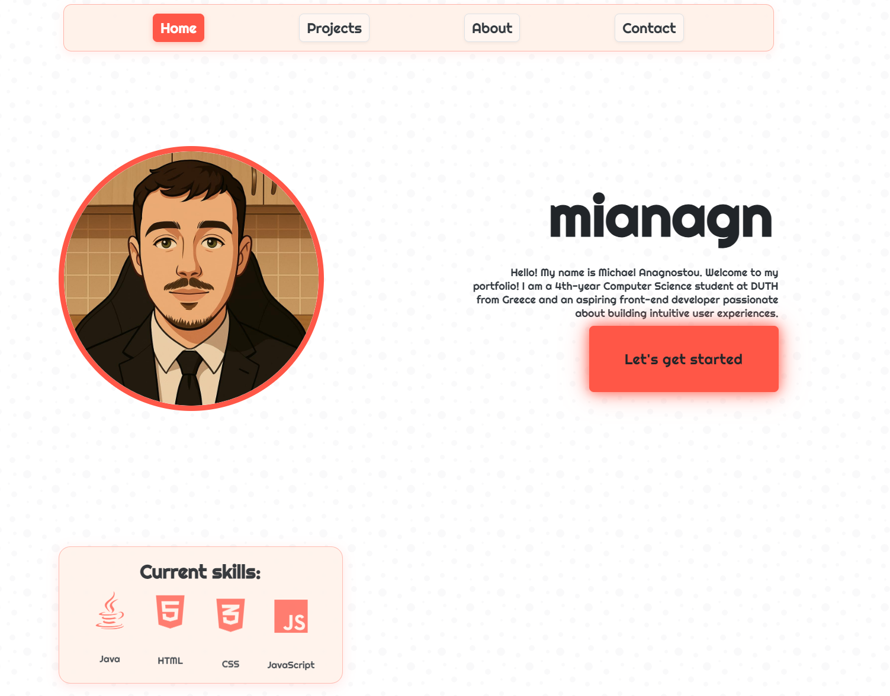

# Michael Anagnostou - Personal Portfolio

## 🚀 Live Site
[View Live Portfolio](https://mianagn.github.io)

## ✨ Features

- **Responsive Design:** Fully responsive layout that works on all devices
- **Theme Switcher:** Toggle between light and dark themes with smooth transitions
- **Interactive Elements:** Buttons and cards with hover effects and animations
- **Optimized Performance:** Minified CSS and efficient JavaScript
- **Accessibility:** Semantic HTML

## 🛠️ Technologies Used

- **HTML5** - Semantic structure
- **CSS3** - Custom styling with variables and animations
- **JavaScript** - Interactive elements and theme switching
- **Libraries:**
  - Font Awesome (icons)
  - Animate.css (animations)
  - Tippy.js (tooltips)

## 📋 Project Sections

- **Home:** Introduction and quick access to skills
- **Projects:** Showcase of development work with GitHub links
- **About:** Education, work experience and skills summary
- **Contact:** Social media links and contact information

## 🖌️ Design Highlights

- Custom CSS animations for skill icons
- Glassmorphism card design with backdrop filters
- Theme-specific image swapping
- Interactive navigation system
- Floating action button for theme toggle

## 📱 Responsive Breakpoints

- Mobile: up to 767px
- Tablet: 768px-1024px
- Desktop: 1025px-1499px
- Large Desktop: 1500px+

## 📧 Contact

Feel free to reach out through any of the social links on the site.

---

*This portfolio is continuously being updated as I grow as a developer.*
